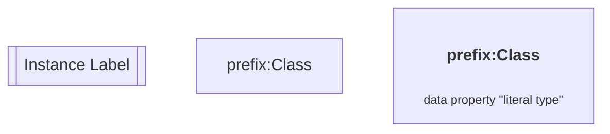
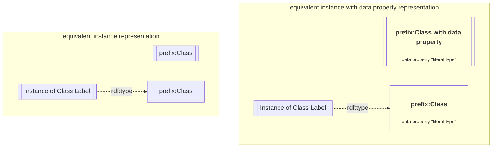
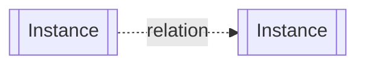
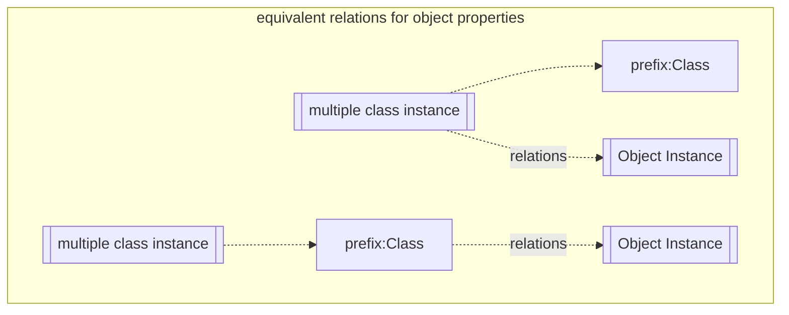
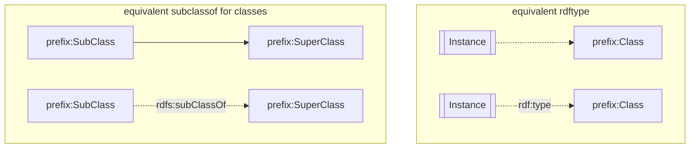
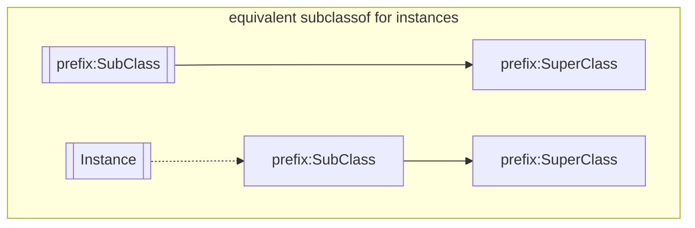
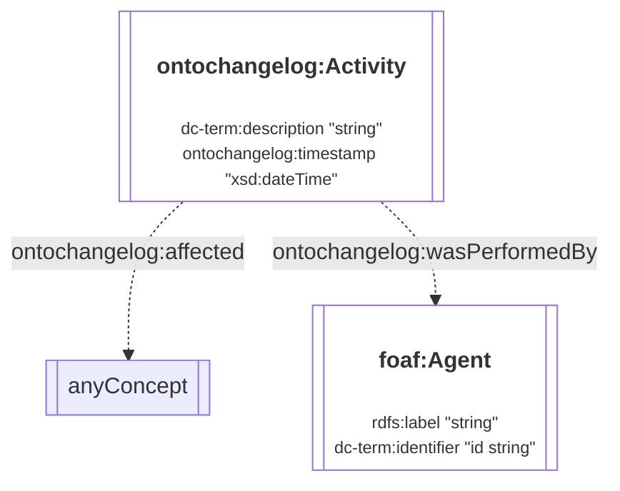

# 1. Ontology for Changelogs

OntoChangelog is designed to provide a clear history of every change, acting as a digital paper trail that records who made a change, when it occurred, and a description of the action. This document serves to explain the modelling decisions and provide example usage of the ontology alongside the external ontologies.

The namespace for the ontology is:

<i>https://theworldavatar.io/kg/ontochangelog/</i>

## Table of Contents

- [1. Ontology for Changelogs](#1-ontology-for-changelogs)
- [2. Data Model](#2-data-model)
  - [Legend](#legend)
  - [2.1 Activity](#21-activity)

# 2. Data Model

## Legend

> Ontology Diagram

The representation of a class and instance is denoted by the node's shape. This means that an instance of the `Person` class will share the same label as the `Person` class itself, and they can only be distinguished by their shape. Literals are represented within the node of the class or instances. The label of instance nodes represent either a label for the purpose of explaining the diagram or the class it is `rdf:type` of (it is a class label if a prefix is available). Instance with labels will also be link to their respective class eg `prefix:Class` to clarify the instance. Multiple instance nodes for the same class in one diagram describes distinct instances of the class that is typically linked by different relations and instances.

Relations between instances of one or more classes are indicated as dotted lines.

Relations linked to a class will also be applied to their instances.

Unlabelled arrows references `rdfs:subClassOf` and `rdf:type` for solid and dotted lines respectively.

> Namespace Prefix

| Prefix            | Namespace                                                                                        |
| ----------------- | ------------------------------------------------------------------------------------------------ |
| dc-term           | `http://purl.org/dc/terms/`                                                                      |
| foaf              | `http://xmlns.com/foaf/0.1/`                                                                     |
| rdfs              | `http://www.w3.org/2000/01/rdf-schema#`                                                          |
| ontochangelog     | `https://theworldavatar.io/kg/ontochangelog/`                                                    |

## 2.1. Activity

The basis of this ontology revolves around the `Activity` concept, which describes the action and when the action took place. The ontology also defines the individual or automated system responsible for triggering the activity through the `foaf:Agent` concept. To enable flexibility in recording these actions, the activity can be associated with any instance.

Figure 1: TBox representation for an Activity

